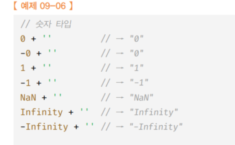
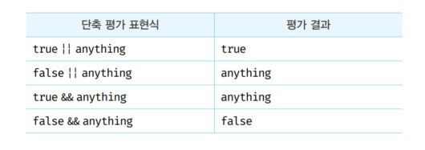

## 목차

[📗배운 점 ](#📗배운-점)

- [📗배운 점](#배운-점)
  - [타입변환](#타입변환)
    - [명시적 타입변환(toString) vs 암묵적 타입 변환(+' ')](#명시적-타입변환tostring-vs-암묵적-타입-변환-)
    - [9.2 ✏️암묵적 형변환](#92-️암묵적-형변환)
      - [+ 는 문자열로, 나머지 연산자는 다 숫자로 타입변환](#-는-문자열로-나머지-연산자는-다-숫자로-타입변환)
    - [9.3 ✏️명시적 타입 변환](#93-️명시적-타입-변환)
    - [9.4 ✏️단축 평가](#94-️단축-평가)
      - [객체를 가리키기를 기대한 변수가 null or undefined 가 아닌지 확인하고 프로퍼티를 참조할 때](#객체를-가리키기를-기대한-변수가-null-or-undefined-가-아닌지-확인하고-프로퍼티를-참조할-때)
        - [09-23](#09-23)
        - [09-24 단축 평가를 사용](#09-24-단축-평가를-사용)
      - [9.4.2 옵셔널 체이닝 연산자](#942-옵셔널-체이닝-연산자)
      - [9.4.3 null 병합 연산자](#943-null-병합-연산자)
        - [09-30](#09-30)
        - [09-31](#09-31)
          - [09-32](#09-32)
  - [🤔궁금한 점](#궁금한-점)
  - [📌중요한 점](#중요한-점)

[🤔궁금한 점](#🤔궁금한-점)

[📌중요한 점](#📌중요한-점)

# 📗배운 점

## 타입변환

암묵적 타입변환은 기존 변수값을 재할당하여 **변경하는 것이 아니다.**

> 💁‍♂️ 자바스크립트 엔진은 표현식을 에러없이 평가하기위해 **피연산자의 값을 암묵적 타입 변환해 새로운 타입의 값을 만들어 단 한 번 사용하고 버린다.**

### 명시적 타입변환(toString) vs 암묵적 타입 변환(+' ')

🤔 뭘 더 사용해야지?

- 코드를 예측할 수 있는, 이해할 수 있는 방법이 더 중요하다.

### 9.2 ✏️암묵적 형변환

#### + 는 문자열로, 나머지 연산자는 다 숫자로 타입변환




### 9.3 ✏️명시적 타입 변환

```js
//문자열 타입으로 변환
String()
Object.prototype.toString()

//숫자 타입으로 변환
Number()
parseInt, parseFloat
+
*

//불리언 타입으로 변환
Boolean
!!
```

### 9.4 ✏️단축 평가



#### 객체를 가리키기를 기대한 변수가 null or undefined 가 아닌지 확인하고 프로퍼티를 참조할 때

##### 09-23

기대하는 값이 객체가 아니라 `null or undefined`이면 타입에러 발생, 프로그램 강제 종료

```javascript
var elem = null;
var value = elem.value; // TypeError: Cannot read property 'value' of null
```

- 이때 단축 평가를 사용하면 에러 발생❌

##### 09-24 단축 평가를 사용

```javascript
var elem = null;
// elem이 null이나 undefined와 같은 Falsy 값이면 elem으로 평가되고
// elem이 Truthy 값이면 elem.value로 평가된다.
var value = elem && elem.value; // -> null
```

#### 9.4.2 옵셔널 체이닝 연산자

```javascript
var str = "";

// 문자열의 길이(length)를 참조한다. 이때 좌항 피연산자가 false로 평가되는 Falsy 값이라도
// null 또는 undefined가 아니면 우항의 프로퍼티 참조를 이어간다.
var length = str?.length;
console.log(length); // 0
```

#### 9.4.3 null 병합 연산자

`??`는 좌항의 피연산자가 null or undefinde의 경우, 우항의 피연산자 반환. 그렇지 않으면 좌항 피연산자 반환.

➡️ 기본값 설정에 유용

###### 09-30

```javascript
// 좌항의 피연산자가 null 또는 undefined이면 우항의 피연산자를 반환
// 그렇지 않으면 좌항의 피연산자를 반환
var foo = null ?? "default string";
console.log(foo); // "default string"
```

##### 09-31

```javascript
// Falsy 값인 0이나 ''도 기본값으로서 유효하다면 예기치 않은 동작이 발생할 수 있다.
var foo = "" || "default string";
console.log(foo); // "default string"
```

###### 09-32

```javascript
// 좌항의 피연산자가 Falsy 값이라도 null 또는 undefined가 아니면 좌항의 피연산자를 반환한다.
var foo = "" ?? "default string";
console.log(foo); // ""
```

## 🤔궁금한 점

## 📌중요한 점
